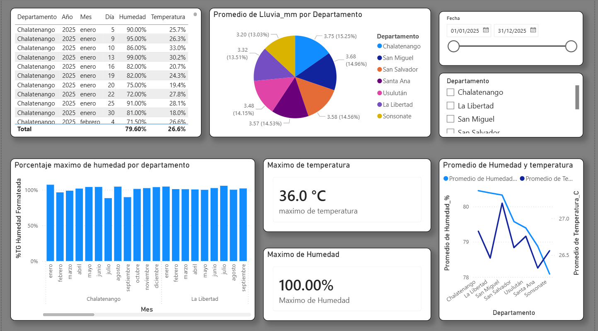
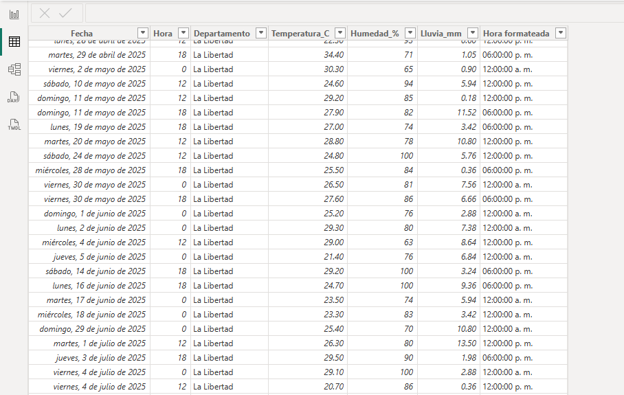
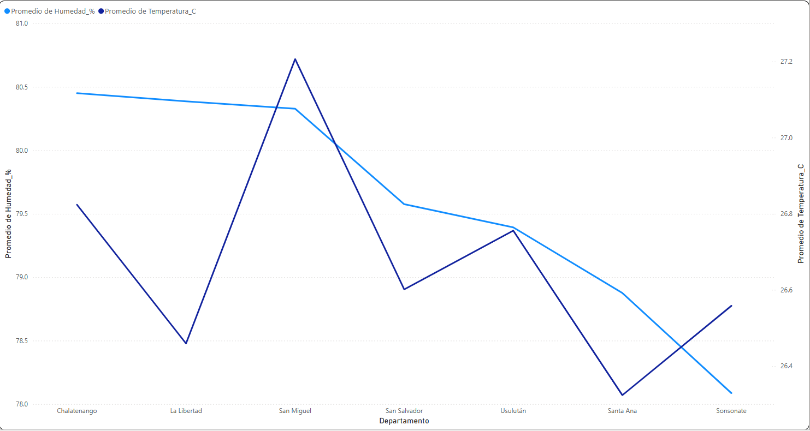

# Climate Data Analysis Dashboard

This project presents a climate data analysis dashboard built with **Power BI** using sensor data collected continuously over a 12-month period.

The dashboard allows exploration of climate variables such as:

- Temperature
- Humidity
- Precipitation

The goal is to identify patterns and compare climate metrics across different regions.

---

## Technologies

- Power BI
- Python
- CSV Data Processing

---

## Dashboard Overview



---

## Dataset Example



---

## Visualization Example



---

## Project Structure

```
dashboard/
    climate-dashboard.pbix

data/
    dataset.csv

images/
    dashboard.png
    dataset.png
    chart.png
```

---

## Author

Gonzalo Chavez
