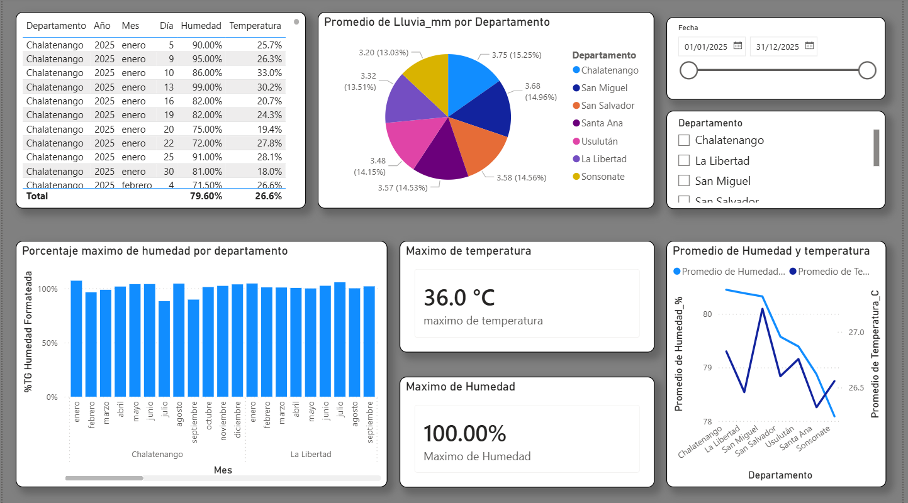
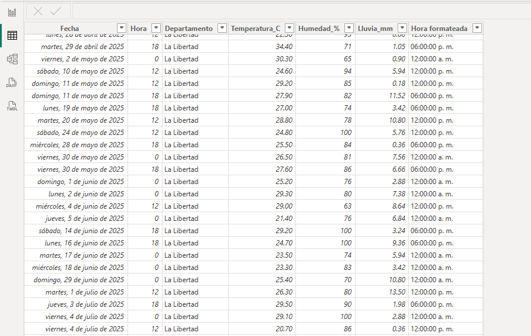
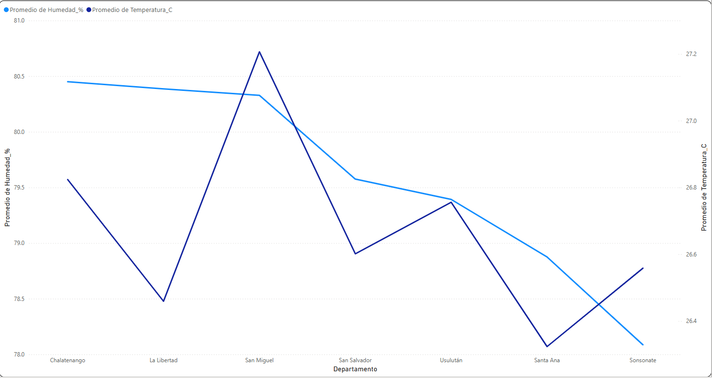

# 🌍 Climate Data Analysis Dashboard

This project presents a climate data analysis dashboard built with **Power BI** using sensor data collected continuously over a 12-month period.

The dashboard enables the exploration of key climate variables such as temperature, humidity, and precipitation, helping identify patterns and compare environmental conditions across different regions.

---

## 📊 Objectives

* Analyze climate trends over time
* Compare temperature, humidity, and precipitation across regions
* Identify extreme values (maximums and minimums) in environmental data
* Transform raw data into clear and interactive visual insights

---

## 🧰 Technologies

* Power BI
* Python (data preprocessing)
* CSV data processing

---

## 📸 Dashboard Overview



---

## 📁 Dataset Example



---

## 📈 Visualization Example



---

## 🧠 Key Insights

* Climate variables show noticeable variation across different regions
* Temperature and humidity trends reveal seasonal patterns over the 12-month period
* Extreme values (peaks and drops) help identify unusual environmental conditions
* Proper formatting of metrics improves readability and interpretation of percentage-based data

---

## 🧮 DAX Measures

To enhance the analysis, several **DAX measures** were implemented to calculate key metrics and improve data presentation.

### 🔹 Average Humidity (Formatted)

```DAX
Humedad Formateada = 
AVERAGE('datos_meteorologicos_agricolas_sv_simulados'[Humedad_%]) / 100
```

> This measure normalizes humidity values to display them correctly as percentages in the dashboard visuals.

---

### 🔹 Maximum Humidity (Formatted)

```DAX
Maximo de Humedad = 
MAX('datos_meteorologicos_agricolas_sv_simulados'[Humedad_%]) / 100
```

> Used to identify peak humidity levels across regions while ensuring proper percentage formatting.

---

### 🔹 Maximum Temperature

```DAX
maximo de temperatura = 
MAX('datos_meteorologicos_agricolas_sv_simulados'[Temperatura_C])
```

> Captures the highest recorded temperature to highlight extreme climate conditions.

---

### 🔹 Average Temperature (Formatted)

```DAX
temp format = 
AVERAGE('datos_meteorologicos_agricolas_sv_simulados'[Temperatura_C]) / 100
```

> Applied to improve visual consistency when displaying temperature-related metrics.

---

## 📂 Project Structure

```
dashboard/
    climate-dashboard.pbix

data/
    dataset.csv

images/
    dashboard.png
    dataset.png
    chart.png
```

---

## 👨‍💻 Author

**Gonzalo Chavez**
